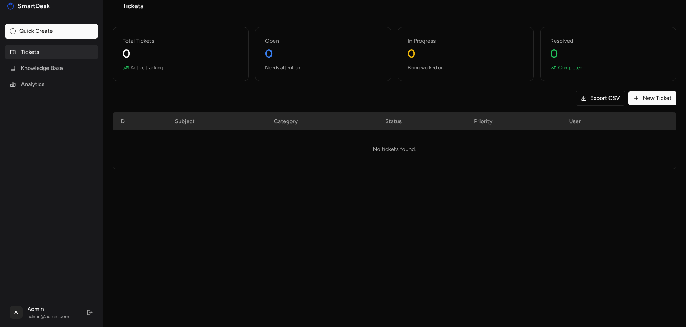
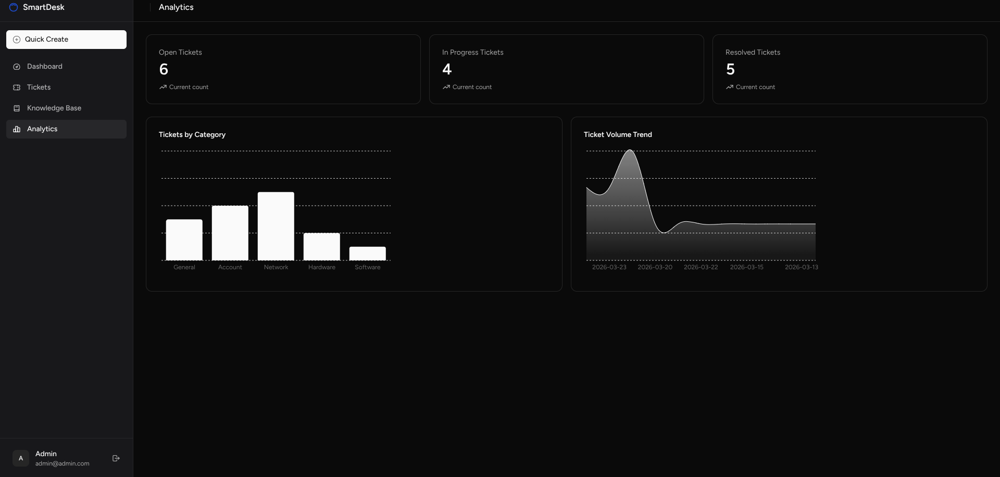
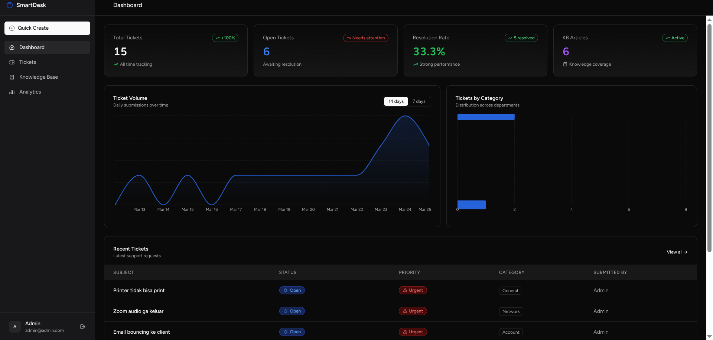
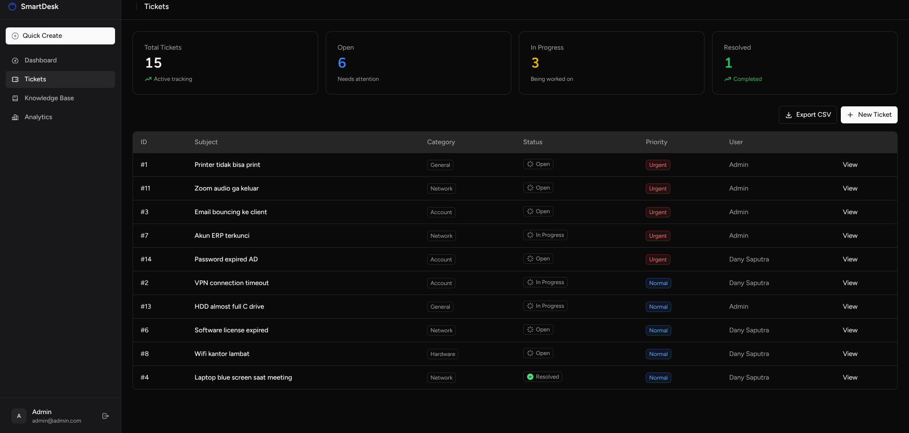
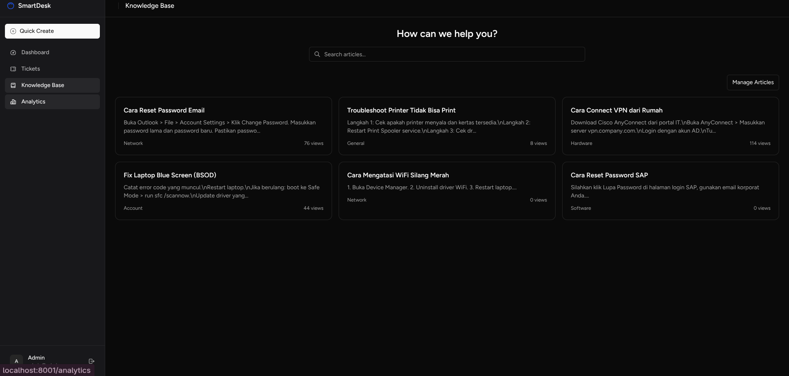
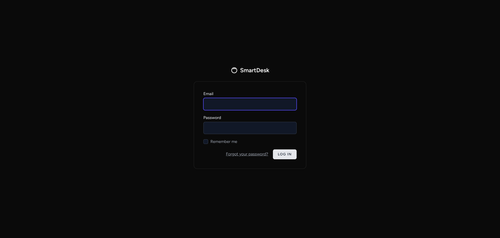

# Smart IT Helpdesk 🚀

> A modern, end-to-end IT Support Management platform built to streamline employee request workflows and reduce repetitive IT inquiries through an integrated Knowledge Base and Service Level Agreement (SLA) tracking system.

## 🎯 Project Overview & Business Value

In many organizations, IT teams spend excessive time handling repetitive, low-level inquiries (e.g., "how to reset my password" or "printer is jammed"). My objective was to build a system that acts as a **smart filter**:
1. **Self-Service First**: Employees are automatically suggested solutions from the Knowledge Base before submitting a ticket.
2. **Prioritization & SLA**: Tickets that do reach the IT team are strictly categorized and tracked against strict time-to-resolution targets (SLAs).
3. **Data-Driven Insight**: IT Managers get immediate visibility into support volume and bottleneck categories via the Analytics Dashboard.

**Impact**: This workflow has the potential to *reduce repetitive tickets by up to 30-50%* while ensuring zero requests slip through the cracks.

---

## 📸 System Gallery & Features

### 1. Dashboard & SLA Tracking
The central hub for IT Admins. Provides real-time metrics on open tickets, resolution rates, and recent ticket activity. Tickets are visually tagged with SLA targets (e.g., *Urgent: 1h target*, *Normal: 4h target*) and pulse warnings when breached.


### 2. Interactive Analytics
A dedicated analytics view featuring responsive charts (built with Recharts) that map daily ticket volume trends and distribute support requests by department/category, helping managers spot recurring infrastructure issues.



### 3. Ticket Management
Rich ticket detail views that show the complete conversation history, assignees, and real-time status transitions. Includes Toast Notifications for instant UX feedback.


### 4. Knowledge Base (Public & Admin View)
The self-service heart of the platform. A searchable library of guides and solutions. When an employee types a related complaint, the system suggests these articles instantly.


### 5. Secure Authentication
Role-based access control (RBAC) separating standard `User` privileges from `Admin` capabilities.


---

## 🛠️ Tech Stack & Architecture

This project was built focusing on modern SPA (Single Page Application) principles, eliminating page reloads while maintaining the robust backend ecosystem of Laravel.

- **Frontend:**
  - **React 19** + **Inertia.js** (Server-driven SPA routing)
  - **Tailwind CSS** + **shadcn/ui v4** (Premium, accessible UI components)
  - **Recharts** (Interactive data visualization)
  - **React Hot Toast** (Real-time application feedback)
- **Backend:**
  - **Laravel 11** (PHP Framework)
  - **SQLite / MySQL**
  - **Laravel Breeze** (Auth scaffolding)
- **Design System:**
  - Glassmorphism dark mode out-of-the-box
  - HSL-driven CSS variables for custom theming

## 🚀 How to Run Locally

You can spin up this project locally with the dummy data (30 realistic IT tickets pre-seeded).

```bash
# 1. Clone the repository
git clone https://github.com/qinleeyan/smart-helpdesk.git
cd smart-helpdesk

# 2. Install PHP Dependencies
composer install

# 3. Install NPM Dependencies
npm install

# 4. Setup Environment
cp .env.example .env
php artisan key:generate

# 5. Migrate & Seed Database 
# (This seeds 30 realistic dummy tickets + sample KB articles)
php artisan migrate:fresh --seed

# 6. Run the Dev Servers (Run these simultaneously)
php artisan serve
npm run dev
```

### Default Demo Accounts

**Admin User:**
- Email: `admin@example.com`
- Password: `password`

**Regular Employee User:**
- Email: `test@example.com`
- Password: `password`

---
*Built by Dany Saputra.*
